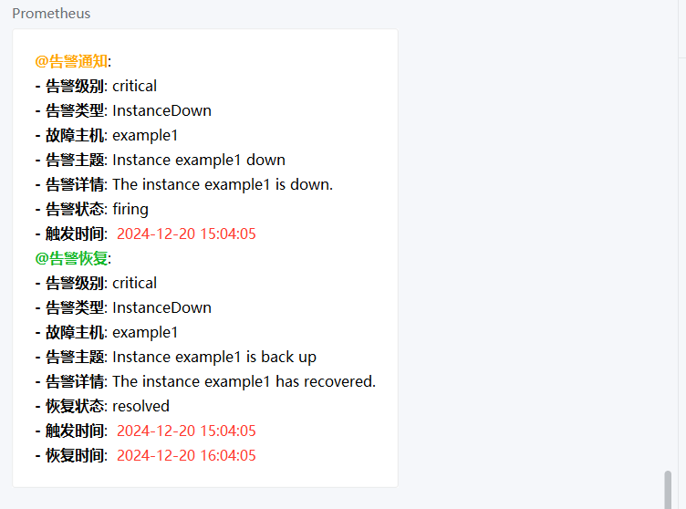

* 参考[开源项目](https://github.com/SeanGong/wechatrobot)

# alertmanager-wechat-webhook

prometheus 告警使用 alertmanager 通过群机器人发送到企业微信群，消息使用 markdown 展示。该程序将企业微信群机器人 URL 转换为 alertmanger 易于配置的 webhook 方法。

## 使用方法

```bash
make build
./alertmanager-wechat-webhook --addr=5001 --robotkey ="xxxxxx-xxx-xxx-xxx-xxx"
```

or

```bash
go run main.go --robotkey="xxxxxx-xxx-xxx-xxx-xxx"
```

> 程序启动时传的 robotkey，是可以被 alertmanager.yml 中配置的 webhook url 中的 key 覆盖掉，如 http://127.0.0.1:5001/webhook?key=xxxxxx-xxx-xxx-xxx-xxx，即发送给指定的群机器人 xxxxxx-xxx-xxx-xxx-xxx。
>
> 如果都没有指定key则会发送不成功。


## 配置

alertmanager.yml

```yml
receivers:
  - name: alertmanager-wechat-webhook                                                                                                           
    webhook_configs:                                                                                                             
      - url: 'http://127.0.0.1:5001/webhook?key=xxxxxx-xxx-xxx-xxx-xxx'
```

## 测试

### 1、命令行或者url携带key都是可以的

* url上的key会覆盖命令行所配置的key

```json
curl -X POST "http://localhost:5001/webhook?key=xxxxxx-xxx-xxx-xxx-xxx" -H "Content-Type: application/json" -d '{
  "alerts": [
    {
      "status": "firing",
      "labels": {
        "severity": "critical",
        "alertname": "InstanceDown",
        "instance": "example1"
      },
      "annotations": {
        "summary": "Instance example1 down",
        "description": "The instance example1 is down."
      },
      "startsAt": "2024-12-20T15:04:05Z",
      "endsAt": "0001-01-01T00:00:00Z"
    },
    {
      "status": "resolved",
      "labels": {
        "severity": "critical",
        "alertname": "InstanceDown",
        "instance": "example1"
      },
      "annotations": {
        "summary": "Instance example1 is back up",
        "description": "The instance example1 has recovered."
      },
      "startsAt": "2024-12-20T15:04:05Z",
      "endsAt": "2024-12-20T16:04:05Z"
    }
  ]
}'
```


### 2. alertmanager配置
```bash
receivers:
- name: 'wechat-webhook'
  webhook_configs:
  - url: 'http://127.0.0.1:5001/webhook?key=xxxxxxxxxxxxxxxxxxxxx'
    send_resolved: true
```